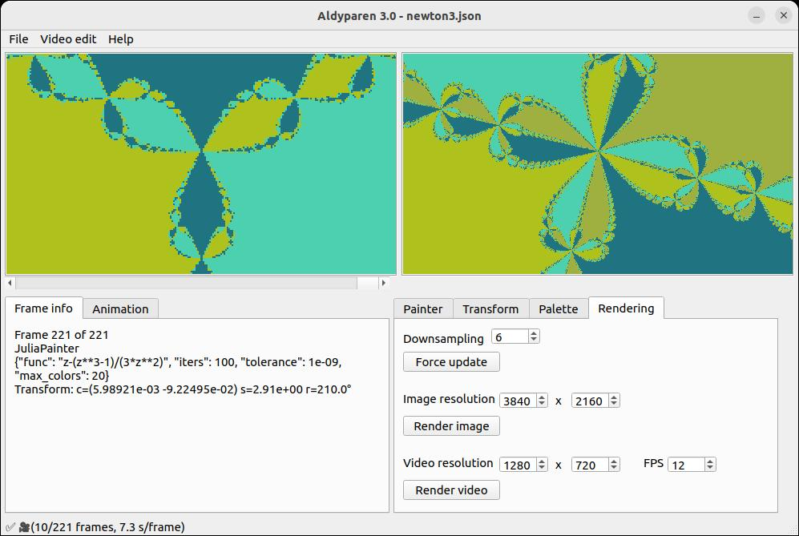
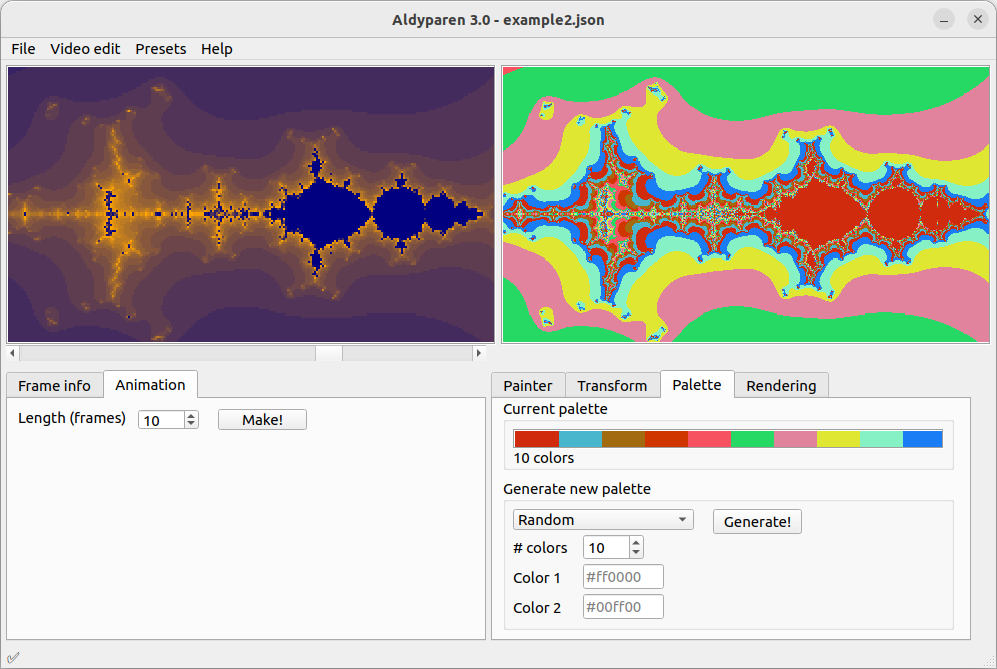

# aldyparen-py

Aldyparen (Algebraic Dynamic Parametric Renderer) is a program for rendering certain types of fractals
as high-resolution images or videos.

## Features

* "Work frame" (right-hand side):
    * Allows to explore a fractal (mouse to pan, wheel to zoom, Ctrl+wheel to rotate).
    * Optimized to be interactive (with threads).
    * Can be exported (rendered) to high-precision image (in BMP format).
    * If frame rendering is expensive, increase "downsampling" factor.
        * Then picture will be first
          rendered at low precision, and then "refined". This allows real-time interaction
          (pan/zoom/rotation) even if the picture is expensive to render.
* "Movie" (left-hand side):
    * Can append frames from work frame.
    * Can add smooth animation, where frames are continuously transformed
      between key frames.
      Animation is added between currently selected movie frame (on the left)
      and work frame (on the right), if they are compatible.
        * For example, it can transform function `z^2` to `z^3` through `z^2.5`.
    * Can be exported (rendered) to a video file in MP4 format.
* "Painters" - abstract framework allowing exploring and rendering different things:
    * `MandelbroidPainter` - generalization of [Mandelbrot set](https://en.wikipedia.org/wiki/Mandelbrot_set) for
      arbitrary function.
        * Basically replaced `z^2+c` with arbitrary `f(z,c)`.
    * `MadnelbrotHighPrecisionPainter` - high-precision Mandelbrot set renderer. Uses arbitrary-precision arithmetic.
        * Will render Mandelbrot set correctly at very high zoom, where standard complex128 arithmetic
          fails because of insufficient precision.
        * Panning with mouse will not work at very high zoom, but you can specify center with arbitrary precision in a
          text
          edit in the "Transform" tab, and it will work correctly.
        * Is not well optimized. Long arithmetic implemented from scratch in Python and
          sped up with Numba.
        * I originally intended this for rendering video of deep zooms,
          but there is much better specialized software for that.
    * `JuliaPainter` - displays [Julia set](https://en.wikipedia.org/wiki/Julia_set).
        * Can be used to show [Newton fractal](https://en.wikipedia.org/wiki/Newton_fractal)
          (pass `func = z - P(z)/P'(z)`).
    * `SierpinskiCarpetPainter` - renders [Sierpinski carpet](https://en.wikipedia.org/wiki/Sierpi%C5%84ski_carpet),
      as an example of non-algebraic fractal.
* Configurable color palette.
    * Painters are supposed to return numbers of colors (0,1,2...). Then they are mapped
      to RGB colors using palette. If palette is smaller than number of colors, it's
      repeated from beginning.
    * There are some preset palettes (grayscale, gradient, etc.).
    * You can change individual colors by clicking on them in the "Palette" tab.

## UI screenshots




## Examples

* Example of using this as Python library - [link](examples/example.ipynb).
* Example project - [link](examples/example_project_1.json).

## Development notes

This application is written in Python using PyQt5.
UI layout designed using [Qt Designer](https://doc.qt.io/qt-6/qtdesigner-manual.html).
I used [Numba](https://numba.pydata.org/) for optimizing numerical calculations.

This is a Python clone (rewritten from scratch) of [Aldyparen](https://github.com/fedimser/Aldyparen),
which I have written in C# back in 2017.
This app has all the functionality of the old Aldyparen, plus some extra features (e.g. new "painters").

To install reequirements, and run program from source, run (it's recommended to use virtualenv):

```
pip3 install -r requirements.txt
python3 run_gui.py
```

To run tests and validate style before submit, run:

```
pip3 install -r requirements.txt
pip3 install pycodestyle pytest
pycodestyle --max-line-length=120 ./aldyparen && python3 -m pytest .
```