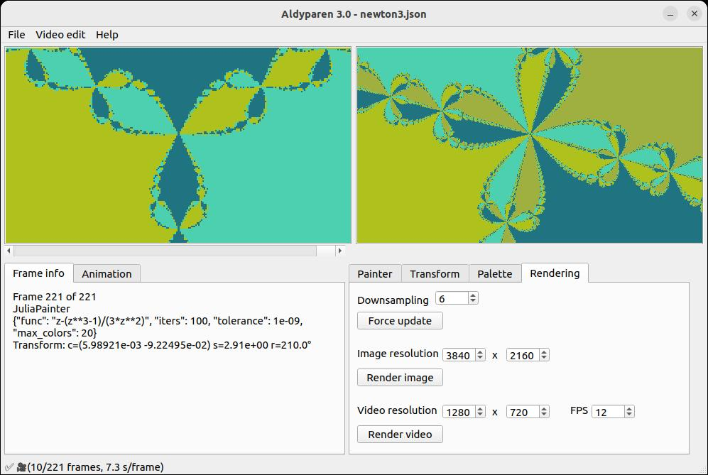
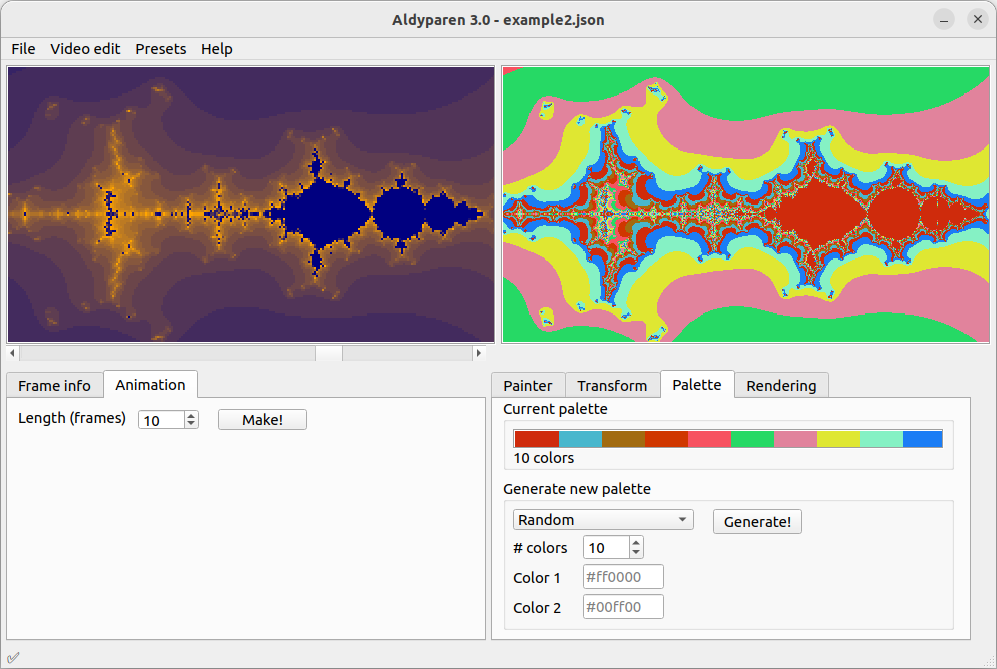

# aldyparen-py

Aldyparen (Algebraic Dynamic Parametric Renderer) is a program for rendering certain types of fractals
as high-resolution images or videos.

## Features

* "Work frame" (right-hand side):
    * Allows to explore a fractal (mouse to pan, wheel to zoom, Ctrl+wheel to rotate).
    * Optimized to be interactive (with threads).
    * Can be exported (rendered) to high-precision image (in BMP format).
    * If frame rendering is expensive, increase "downsampling" factor.
        * Then picture will be first
          rendered at low precision, and then "refined". This allows real-time interaction
          (pan/zoom/rotation) even if the picture is expensive to render.
* "Movie" (left-hand side):
    * Can append frames from work frame.
    * Can add smooth animation, where frames are continuously transformed
      between key frames.
      Animation is added between currently selected movie frame (on the left)
      and work frame (on the right), if they are compatible.
        * For example, it can transform function `z^2` to `z^3` through `z^2.5`.
    * Can be exported (rendered) to a video file in MP4 format.
* "Painters" - abstract framework allowing exploring and rendering different things. See section "Painters" below.
* Configurable color palette.
    * Painters are supposed to return numbers of colors (0,1,2...). Then they are mapped
      to RGB colors using palette. If palette is smaller than number of colors, it's
      repeated from beginning.
    * There are some preset palettes (grayscale, gradient, etc.).
    * You can change individual colors by clicking on them in the "Palette" tab.

## Painters

* `MandelbroidPainter` - generalization of [Mandelbrot set](https://en.wikipedia.org/wiki/Mandelbrot_set) for
  arbitrary function.
    * Basically replaced `z^2+c` with arbitrary `f(z,c)`.
    * It has parameters: `gen_function` (a function of two arguments `z` and `c`, for example `"z**2+c""`),
        `radius` and `max_iter`.
    * To paint point `c`, we start we `z=0` and repeat `z := gen_function(z,c)` until either `|z| > radius` or
        we did `max_iter` iterations. Number of iterations made determines the color of the point `c`.
      * I call such generalized Mandlbrot fractal a "Mandelbroid fractal".
* `MadnelbroidHighPrecisionPainter` - paints Mandelbroid fractal, but with high-precision.
    * Will render Mandelbroid set correctly at very high zoom, where standard 64-bit floating point arithmetic
      fails because of insufficient precision. To illustrate why we need high-precision, compare these two pictures: 
      [1](https://photos.app.goo.gl/T1M72irowzJn4Nqd6), [2](https://photos.app.goo.gl/ZtiAdVYQJ4W1MfzU7).
      They both show the same region of the [Burning Ship fractal](https://en.wikipedia.org/wiki/Burning_Ship_fractal),
      but the first one uses standard 64-bit floating arithmetic, while the second uses high-precision arithmetic.
    * Parameters:
        * `gen_function`,`radius` and `max_iter` - same as for `MandelbroidPainter`.
        * `precision` - size of long number. Number of decimal digits after dot is `8*precision`.
    * Currently `gen_function` supports addition, subtraction, multiplication andthe following functions:
        * `sqr` - square, `sqr(z) = z * z`.
        * `abscw` - component-wise modulus, `abscw(z) = |Re(z)| + i*|Im(z)|`.
    * Panning with mouse will not work at very high zoom, but you can specify center with arbitrary precision in a
      text edit in the "Transform" tab, and it will work correctly.
    * It's not well optimized. Long arithmetic implemented from scratch in Python and
      sped up with Numba.
    * I originally intended this for rendering video of deep zooms,
      but there is much better specialized software for that. 
* `MadnelbrotHighPrecisionPainter` - specialized version of `MadnelbroidHighPrecisionPainter`.
    * Renders only Mandelbrot set with fixed `radius=2`, but does it more efficiently.
    * Parameters: `max_iter`.
* `JuliaPainter` - displays [Julia set](https://en.wikipedia.org/wiki/Julia_set).
    * Can be used to show [Newton fractal](https://en.wikipedia.org/wiki/Newton_fractal)
      (pass `func = z - P(z)/P'(z)`).
    * Parameters: `func`, `iters`, `tolerance`, `max_colors`.
* `SierpinskiCarpetPainter` - renders [Sierpinski carpet](https://en.wikipedia.org/wiki/Sierpi%C5%84ski_carpet),
  as an example of non-algebraic fractal.
    * Parameters: `depth`.
* `LyapunovFractalPainter` - renders a [Lyapunov fractal](https://en.wikipedia.org/wiki/Lyapunov_fractal)
  showing stable and chaotic regions of a periodically forced logistic map.
    * Each point in the image supplies two map parameters: `A` is the point's real coordinate and `B` is its
      imaginary coordinate. A repeating sequence such as `"AABAB"` selects the parameter `r` for each iteration
      of `x := r*x*(1-x)`.
    * After discarding the initial warm-up iterations, the painter estimates the Lyapunov exponent as the mean of
      `log(abs(r*(1-2*x)))`. Negative exponents indicate stable behavior, while positive exponents indicate chaos;
      quantizing their signs and magnitudes produces branching and swallow-shaped structures.
    * Parameters:
        * `sequence` - a non-empty string containing only `A` and `B`, repeated throughout the calculation.
        * `warmup` - number of initial iterations discarded before measuring the exponent.
        * `iterations` - number of iterations used to estimate the exponent.
        * `color_scale` - controls how exponent magnitude is mapped to palette indices.
    * Stable exponent bands use odd palette indices and chaotic bands use even indices. Index 0 is reserved for
      points where the exponent cannot be computed.
* `MagneticPendulumPainter` - simulates the [basins of attraction](https://en.wikipedia.org/wiki/Attractor) of a
  damped pendulum moving above three or more magnets.
    * Each image coordinate is the pendulum's initial horizontal position. The painter numerically integrates its
      motion under magnetic attraction, a restoring force, and damping until it settles near a magnet or reaches
      the step limit. The interwoven boundaries between magnets' attraction basins form a fractal and can exhibit
      the [Wada property](https://en.wikipedia.org/wiki/Wada_basin).
    * `magnets` is a list of objects containing `x`, `y`, and positive `strength` values. `height`, `damping`, and
      `gravity` control the physical model, while `time_step` and `max_steps` control numerical integration.
      `settle_distance` and `settle_speed` define when the pendulum is considered captured.
    * Palette index 0 represents trajectories that do not settle. Settled trajectories are colored primarily by
      the magnet reached and secondarily by settling time; the Magnetic pendulum preset supplies a matching
      structured palette.
    * Animation can smoothly move magnets and vary their strengths and simulation parameters. Both key frames
      must contain the same number of magnets, whose list order determines their correspondence.


## UI screenshots




## Examples

* Example of using this as Python library - [link](examples/example.ipynb).
* Example project - [link](examples/example_project_1.json) (rendered video - [link](https://www.youtube.com/watch?v=fsI0lQ-PMnI)).
* Example high-resolution renders - [link](https://photos.app.goo.gl/TRyUn9QRy7kJ1sYP8).

## How to install and run

Requirements:
* OS: Windows/Linux/MacOS.
* Python 3.12, 3.13 or 3.14.
* Git.

Run from command line:
```
git clone https://github.com/fedimser/aldyparen-py.git
cd aldyparen-py
pip install -e .[lint,test,dev]
python3 run_gui.py
```

## Development notes

This application is written in Python using PyQt5.
UI layout designed using [Qt Designer](https://doc.qt.io/qt-6/qtdesigner-manual.html).
I used [Numba](https://numba.pydata.org/) for optimizing numerical calculations.

This is a Python clone (rewritten from scratch) of [Aldyparen](https://github.com/fedimser/Aldyparen),
which I have written in C# back in 2017.
This app has all the functionality of the old Aldyparen, plus some extra features (e.g. new "painters").

To start development, create virtualenv and install dependencies:
```
pip install -e .[lint,test,dev]
```

To run tests and validate style before commit, run:
```
./lint.sh && python3 -m pytest .
```

To check test coverage:

```
python -m coverage run -m pytest . && python -m coverage report -m
```
